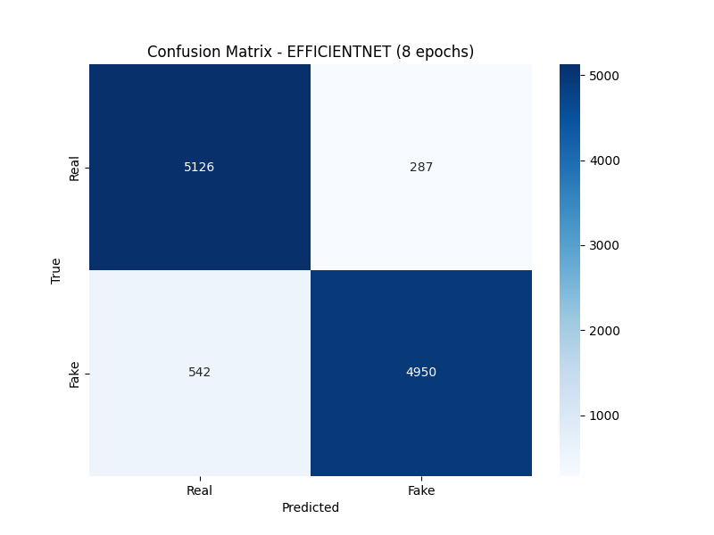
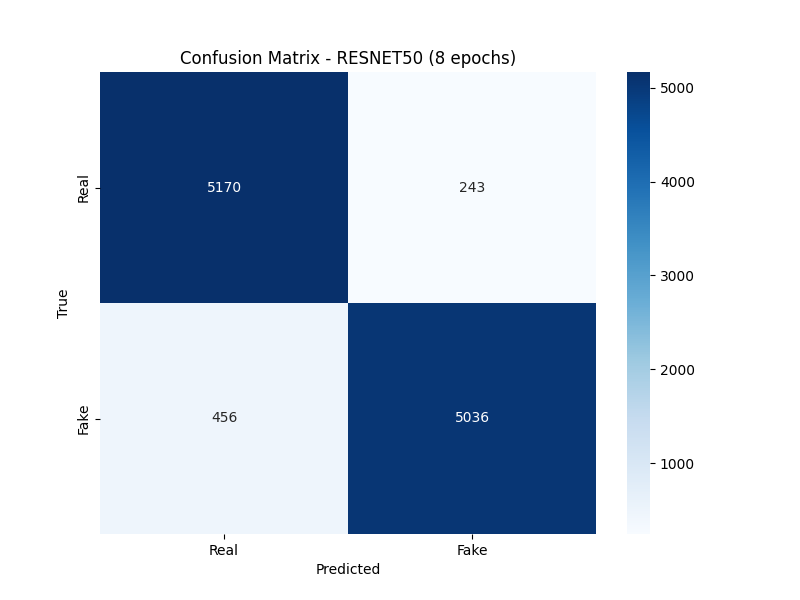

# HYU-AI-G08  
**Hanyang University AI & Application Course Project (G08, Fall 2024)**  

## Group Members:
1. **Jan Rudkowski**, Warsaw University of Technology, jan.rudkowski.stud@pw.edu.pl
2. **Konrad Wojda**, Warsaw University of Technology, konrad.wojda.stud@pw.edu.pl
3. **Ruke Sam-Ogaga**, Rose-Hulman Institute of Technology, samogaoe@rose-hulman.edu  
4. **Isabel Pfeiffer**, University Pforzheim, Isabel.pfeiffer01@gmail.com

## Project Title: 
**Deep Fake Facial Image Detector**

## Introduction - Initial Proposal (Assignment 1):
In recent years, with the rapid advancement of AI and the ease of generating fake images, “deep fakes” have emerged as a significant threat. These digitally altered images, videos, and audios impact not only celebrities but also everyday individuals. This issue has gained particular attention in Korea, where deep fake crimes have reached unprecedented levels. The number of underage victims has increased 4.5 times, from 64 in 2022 to 288 over the past two years, while the total number of victims grew 3.7 times, rising from 212 to 781 during that same period according to *[Yonhap News Agency](https://en.yna.co.kr/view/AEN20240828003100315)*. This alarming growth inspired us to focus on developing a solution to detect deep fake images in hopes to help combat this growing concern.

Our objective is to build an accurate deep fake facial image detector by training and comparing the performance of various models. To accomplish this, we plan to utilize this *[Kaggle dataset](https://www.kaggle.com/datasets/manjilkarki/deepfake-and-real-images)*, which contains approximately 190,000 facial images. We will split the dataset into two parts: 80% for training and 20% for validation. The models we intend to use include EfficientNet and ResNet50, among others. Once trained, the models will be analyzed thoroughly to evaluate their effectiveness. Depending on the results, we may further extend the scope of our project.  

For training, we plan to use our local hardware. However, if additional resources are required, we will leverage AWS SageMaker within the limits of available free credits.  

You can follow the progress of our project on our *[Github](https://github.com/konradwojda/HYU-AI-G08)*

## Dataset
For this project, we chose to use a Kaggle dataset created by Manjil Karki "*[deepfake and real images](https://www.kaggle.com/datasets/manjilkarki/deepfake-and-real-images)*". The dataset includes both manipulated (fake) and real images, originally sourced from the *[OpenForensics Dataset](https://sites.google.com/view/ltnghia/research/openforensics)*. The dataset was processed to optimize outcomes for analysis. Each image is a 256 x 256 JPG-format image of a human face, labeled as either real or fake. The dataset contains approximately 190,000 images, divided into three main directories: Train (70,000 fake, 70,000 real), Test (5,492 fake, 5,413 real), and Validation (19,600 fake, 19,800 real).

## Methodology

### Selected CNN Models

For this project, we chose to train and compare two convolutional neural networks **EfficientNet** and **ResNet50** to determine which model performs better for deepfake detection. Both EfficientNet and ResNet50 are widely recognized for their strong feature extraction capabilities and computational efficiency, making them well-suited to the demands of this task.

EfficientNet is designed to achieve high accuracy with fewer parameters by using a compound scaling method that balances depth, width, and resolution. This efficiency allows it to handle complex tasks with limited computational resources, making it an excellent choice for detecting subtle manipulations in images.

ResNet50, on the other hand, introduces residual connections that address the vanishing gradient problem, allowing the network to train effectively even at greater depths. This enables ResNet50 to learn more intricate features, which is particularly useful for distinguishing real images from deepfakes with a high level of detail.

### Infrastructure
For training the models, we decided to use __Amazon SageMaker Studio Lab__, which offers four hours of free GPU usage (NVIDIA Tesla T4). This was sufficient for our project and provided more computational power than the hardware we own. SageMaker Studio Lab offers many tools for developing and training models.

### Brief Code Explanation
In this section, the code will be described. For detailed explanations of all parts of the code, please visit *[Code Explanation](https://github.com/konradwojda/HYU-AI-G08/blob/main/docs/code_explanation.md)*. The main files of our project and their tasks are:

`dataset.py` – The script defines the `DeepFakeDataset` class, a custom PyTorch dataset for loading deepfake images. It takes a root directory containing "Real" and "Fake" subdirectories and generates a list of image file paths with corresponding labels. The class supports optional image transformations and provides methods to retrieve the dataset length and individual image-label pairs, making it suitable for loading data in model training and evaluation.

`train.py` – The script is designed for training a deepfake detection model using PyTorch. It loads and preprocesses a dataset, initializes a specified model (ResNet50 or EfficientNet), and trains it over a specified number of epochs, optimizing with cross-entropy loss and an Adam optimizer. During each epoch, the script computes accuracy, precision, recall, and F1-score metrics for model evaluation, and logs these metrics to a CSV file. The trained model state is saved to a file.

`predict.py` – This script loads a pre-trained model to classify an image as either "Real" or "Fake." It preprocesses the input image and uses a specified or default model file to load weights before making a prediction.

`eval.py` - The script evaluates and visualizes the performance of a deepfake detection model. It loads a trained model, applies it to a test dataset, and generates predictions. Using these predictions, the script computes a confusion matrix, which is then visualized and saved as an image. This matrix offers insight into the model’s performance by showing counts of correct and incorrect predictions for each class (Real vs. Fake). The script scans for model files in a specified folder, allowing for batch evaluation of multiple trained models.

`train_models.sh` – This is simple bash script used to start training on virtual machine. The script automates downloading, unzipping, and training models on a dataset. After unzipping, it trains models at different epoch counts, saving each model and optionally logging metrics.

## Evaluation & Analysis
For both models, a *confusion matrix* and metrics such as *training_loss*, *accuracy*, *precision*, *recall*, and *f1score* have been calculated and will be shown below based on the number of training epochs. Two of them, final scores for 8 epoch training, will be discussed more thoroughly in this paragraph. For detailed metric scores and confusion matrices for epochs 1, 3, 5, and 8, please click *[here](https://github.com/konradwojda/HYU-AI-G08/tree/main/results)*. The maximum number of 8 epochs, which we ultimately decided was sufficient based on the scores, was limited by the time constraints of using Amazon SageMaker Studio Lab. Specifically, the training time for ResNet50 took approximately 3.5 hours, while the same number of epochs for EfficientNet took only about 2 hours and 20 minutes.

### EfficientNet 
#### Metrics:
For clarity, the results are shown with accuracy to four decimal places. More detailed scores are available here *[here](https://github.com/konradwojda/HYU-AI-G08/tree/main/results)*.
| Epoch | Training Loss       | Accuracy           | Precision           | Recall             | F1 Score            |
|-------|---------------------|--------------------|---------------------|--------------------|---------------------|
| 1     | 0.2561              | 0.8815             | 0.8835              | 0.8809             | 0.8822              |
| 2     | 0.0941              | 0.8884             | 0.9240              | 0.8481             | 0.8845              |
| 3     | 0.0728              | 0.9034             | 0.8814              | 0.9339             | 0.9069              |
| 4     | 0.0600              | 0.8972             | 0.8819              | 0.9190             | 0.9000              |
| 5     | 0.0526              | 0.9081             | 0.8787              | 0.9485             | 0.9123              |
| 6     | 0.0475              | 0.8911             | 0.8737              | 0.9161             | 0.8944              |
| 7     | 0.0414              | 0.9030             | 0.8790              | 0.9363             | 0.9067              |
| 8     | 0.0380              | 0.9240             | 0.9452              | 0.9013             | 0.9227              |

#### Confusion Matrix:

### ResNet50
#### Metrics:
For clarity, the results are shown with accuracy to four decimal places. More detailed scores are available here *[here](https://github.com/konradwojda/HYU-AI-G08/tree/main/results)*.
| Epoch | Training Loss       | Accuracy           | Precision           | Recall             | F1 Score            |
|-------|---------------------|--------------------|---------------------|--------------------|---------------------|
| 1     | 0.2981              | 0.8928             | 0.9191              | 0.8631             | 0.8902              |
| 2     | 0.1354              | 0.9100             | 0.9277              | 0.8908             | 0.9089              |
| 3     | 0.1031              | 0.9117             | 0.8781              | 0.9576             | 0.9161              |
| 4     | 0.0812              | 0.9216             | 0.9153              | 0.9304             | 0.9228              |
| 5     | 0.0710              | 0.9364             | 0.9482              | 0.9241             | 0.9360              |
| 6     | 0.0594              | 0.9381             | 0.9396              | 0.9374             | 0.9385              |
| 7     | 0.0528              | 0.8946             | 0.8555              | 0.9516             | 0.9010              |
| 8     | 0.0447              | 0.9359             | 0.9540              | 0.9170             | 0.9351              |

#### Confusion Matrix:

## Conclusion, Result Discussion
Based on the comparison of the results above, ResNet50 consistently outperforms EfficientNet across all key metrics (*training_loss*, *accuracy*, *precision*, *recall*, *f1score*) throughout the training epochs. While both models show steady improvement, ResNet50 achieves higher *accuracy* and maintains superior *precision* and *recall*, leading to a more balanced and effective model overall. EfficientNet, although competitive, exhibits some fluctuations in performance, particularly in *recall* and *precision*. 

The confusion matrices confirm that ResNet50 outperforms EfficientNet in detecting deepfake images. ResNet50 has both higher true positive and true negative counts, as well as fewer false positives and false negatives, leading to better precision, recall, and overall accuracy. Therefore, ResNet50 is the more reliable and effective model for deepfake detection in this project, demonstrating better stability and performance.

## Frontend
Work in progress

## Related Work

**Dataset:**  
[Deepfake Detection Dataset](https://www.kaggle.com/datasets/manjilkarki/deepfake-and-real-images/data)  
[OpenForensics Dataset](https://zenodo.org/records/5528418#.YpdlS2hBzDd)  

**Machine Learning Frameworks:**  
[PyTorch](https://pytorch.org/)  
[TorchVision](https://pytorch.org/vision/stable/index.html)  
[Scikit-learn](https://scikit-learn.org/stable/)  

**Tools:**  
[Matplotlib](https://matplotlib.org/)  
[Seaborn](https://seaborn.pydata.org/)  
[Pillow](https://pillow.readthedocs.io/en/stable/)  
[Numpy](https://numpy.org/)  

**Models:**  
EfficientNet  
ResNet50  

**Cloud Computing Resource:**  
[AWS SageMaker Studio Lab](https://studiolab.sagemaker.aws/)  

**Related Works:**  
*FaceForensics++: Learning to Detect Manipulated Facial Images*, A. Rossler, D. Cozzolino, L. Verdoliva, C. Riess, J. Thies, M. Nießner, [arxiv.org/pdf/1901.08971](https://arxiv.org/pdf/1901.08971)  
*Deepfake Detection Using EfficientNet and XceptionNet*, B. Yasser, O. Abdelhameed, DOI:10.1109/ICICIS58388.2023  
*Deepfake Detection with Deep Learning: Convolutional Neural Networks versus Transformers*, Vrizlynn L. L. Thing, [arxiv.org/pdf/2304.03698](https://arxiv.org/pdf/2304.03698)  
