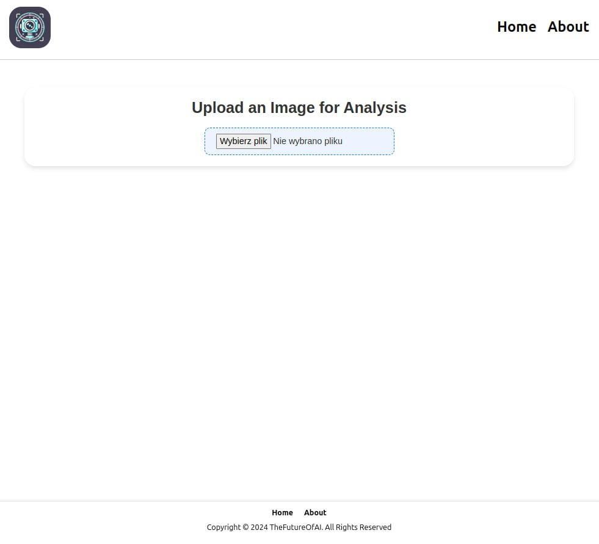
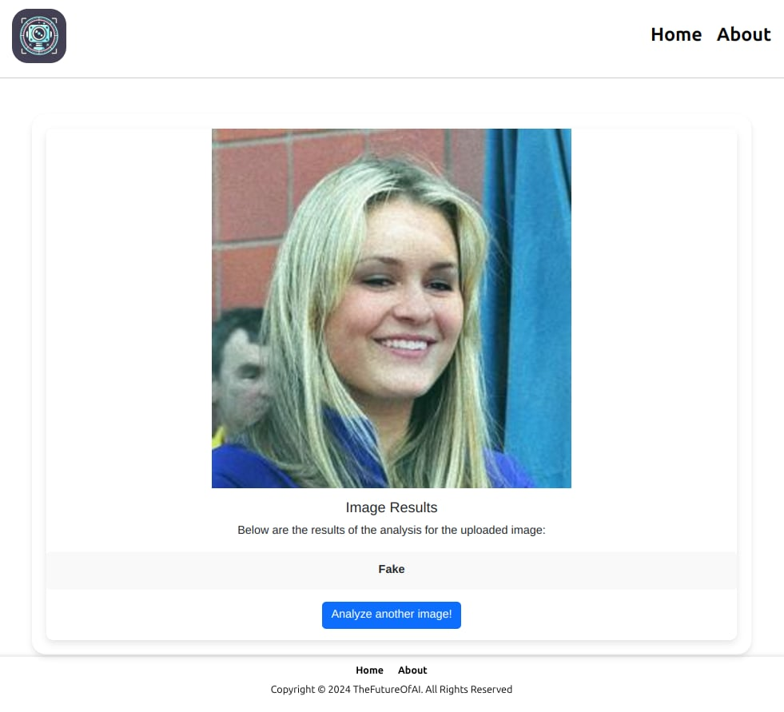

# HYU-AI-G08  
**Hanyang University AI & Application Course Project (G08, Fall 2024)**  

## Group Members:
1. **Jan Rudkowski**, Warsaw University of Technology, jan.rudkowski.stud@pw.edu.pl
2. **Konrad Wojda**, Warsaw University of Technology, konrad.wojda.stud@pw.edu.pl
3. **Ruke Sam-Ogaga**, Rose-Hulman Institute of Technology, samogaoe@rose-hulman.edu  
4. **Isabel Pfeiffer**, University Pforzheim, Isabel.pfeiffer01@gmail.com

## Project Title: 
**Deep Fake Facial Image Detector**

## Introduction - Initial Proposal:
In recent years, with the rapid advancement of AI and the ease of generating fake images, “deep fakes” have emerged as a significant threat. These digitally altered images, videos, and audios impact not only celebrities but also everyday individuals. This issue has gained particular attention in Korea, where deep fake crimes have reached unprecedented levels. The number of underage victims has increased 4.5 times, from 64 in 2022 to 288 over the past two years, while the total number of victims grew 3.7 times, rising from 212 to 781 during that same period according to [Yonhap News Agency](https://en.yna.co.kr/view/AEN20240828003100315). This alarming growth inspired us to focus on developing a solution to detect deep fake images in hopes to help combat this growing concern.

Our objective is to build an accurate deep fake facial image detector by training and comparing the performance of various models. To accomplish this, we utilized this [Kaggle dataset](https://www.kaggle.com/datasets/manjilkarki/deepfake-and-real-images), which contains approximately 190,000 facial images. We will split the dataset into two parts: 80% for training and 20% for validation. The models we intend to use include EfficientNetB0 and ResNet50, among others. Once trained, the models will be analyzed thoroughly to evaluate their effectiveness. Depending on the results, we may further extend the scope of our project.  

For training, we leveraged AWS SageMaker Studio Lab within the limits of available free credits.  

## Dataset
For this project, we chose to use a Kaggle dataset created by Manjil Karki ["deepfake and real images"](https://www.kaggle.com/datasets/manjilkarki/deepfake-and-real-images). The dataset includes both manipulated (fake) and real images, originally sourced from the [OpenForensics Dataset](https://sites.google.com/view/ltnghia/research/openforensics). The dataset contains approximately 190,000 images, divided into three main directories: Train (70,000 fake, 70,000 real), Test (5,492 fake, 5,413 real), and Validation (19,600 fake, 19,800 real).

The dataset was processed to optimize outcomes for analysis. Each image is a 256 x 256 JPG-format image of a human face, labeled as either real or fake. In addition, normalization using mean and standard deviation values derived from the ImageNet dataset was applied. This step standardizes pixel intensities, improving the models' ability to generalize across unseen data. The goal of preprocessing the dataset was to ensure consistency and compatibility with the input requirements of our selected CNN architectures.

Example real facial images from the dataset:

Example fake facial images from the dataset:

## Methodology

### Selected CNN Models

For this project, we chose to train and evaluate two convolutional neural network (CNN) architectures: __EfficientNetB0__ and __ResNet50__. These models are well-regarded for their strong feature extraction capabilities and efficiency, making them suitable for the computational demands of deepfake image detection. By comparing these two architectures, we aimed to determine which model performs better for detecting deepfakes.

EfficientNetB0 employs a compound scaling method that systematically balances the network's depth, width, and resolution. This innovative approach achieves superior accuracy with fewer parameters compared to traditional models. EfficientNetB0's ability to efficiently handle subtle variations in images makes it ideal for identifying the fine-grained manipulations typical of deepfake images.

ResNet50, known for its introduction of residual connections addresses the vanishing gradient problem that arises in deeper networks. These connections allow the model to learn intricate patterns in data, enabling it to effectively distinguish real images from deepfakes. ResNet50's robust architecture is particularly advantageous for analyzing the high levels of detail often present in manipulated images.

### Infrastructure
For training the models, we decided to use __Amazon SageMaker Studio Lab__, a cloud-based machine learning environment that offers free access to computational resources for building, training, and deploying machine learning models. This platform provides preconfigured environments with essential libraries and tools, allowing users to start their projects without the need for extensive setup.

Our choice of SageMaker  Lab was motivated by its capability to provide reliable computational power without incurring additional costs, effectively addressing the hardware limitations of our local machines. The environment supports seamless integration with Python-based machine learning frameworks such as PyTorch, TensorFlow, and Scikit-learn, enabling flexibility and compatibility with our project requirements.

We utilized G4dn.xlarge instance, which feature NVIDIA Tesla T4 GPU, 4 virtual CPUs, 16 GiB of memory, and 125 GB of NVMe SSD storage. These specifications allowed us to handle the computational demands of training deep learning models on a dataset of approximately 190,000 images.

SageMaker  Lab's intuitive interface and robust infrastructure provided us with the necessary tools to develop, train, and evaluate our models effectively within the constraints of the platform's free-tier offering of four GPU hours per session.

### Brief Code Explanation
In this section, the code will be described. For detailed explanations of all parts of the code, please visit [Code Explanation](https://github.com/konradwojda/HYU-AI-G08/blob/main/docs/code_explanation.md). The main files of our project and their tasks are:

### `dataset.py`

The script defines the `DeepFakeDataset` class, a custom PyTorch dataset for loading deepfake images. It takes a root directory containing "Real" and "Fake" subdirectories and generates a list of image file paths with corresponding labels (0 for real images and 1 for fake images). The class supports optional image transformations and provides methods to retrieve the dataset length and individual image-label pairs, making it suitable for loading data in model training and evaluation.

### `train.py`

The script is designed for training a deepfake detection model using PyTorch. It loads and preprocesses a dataset, initializes a specified model (ResNet50 or EfficientNetB0), and trains it over a specified number of epochs, optimizing with cross-entropy loss and an Adam optimizer. During each epoch, the script computes accuracy, precision, recall, and F1-score metrics for model evaluation and logs these metrics to a CSV file. The trained model state is saved to a file. Because the file serves as the backbone of our project, below are its most important features and functions:

- `prepare_model`  
  This function sets up the entire training environment. It preprocesses the dataset using Torchvision transforms, applying resizing, tensor conversion, and normalization based on ImageNet standards to ensure compatibility with the input requirements of the models. The dataset is loaded using the custom `DeepFakeDataset` class, which organizes the images into "Real" and "Fake" categories for training and testing. The function dynamically selects the appropriate CNN architecture, ResNet50 or EfficientNetB0, and modifies it for binary classification by replacing the output layer. The function also initializes a cross-entropy loss function, well-suited for classification tasks, and configures the Adam optimizer for efficient gradient-based updates. Additionally, it determines whether to run the computations on a GPU or CPU using PyTorch’s `torch.device` utility.

- `train` 
  This function is the core of the model training process. It operates in a batch-wise manner, leveraging the DataLoader created in the `prepare_model` function to process input data in small subsets, or batches. This approach optimizes computational efficiency by balancing memory usage and processing speed. For each batch, the model predictions are computed, the error is quantified using the cross-entropy loss function, and the gradients are propagated backward through the network. These gradients are then utilized by the Adam optimizer, which updates the model’s weights based on the learning rate specified in `prepare_model`. This iterative process gradually improves the model's performance by minimizing the error. Finally, the average training loss is computed and returned, providing a key indicator of the model's convergence and learning progress over the course of training.

- `evaluate` 
  To evaluate the model, the `evaluate` function is employed. This function operates in evaluation mode (`model.eval()`), disabling dropout and batch normalization updates for consistent predictions. It uses PyTorch to process the test data and Scikit-learn’s metrics, such as accuracy, precision, recall, and F1 score, to quantify the model’s performance. These metrics provide a comprehensive understanding of the model’s ability to correctly classify images as real or fake, making this function critical for performance analysis.

- `main`  
  The `main` function orchestrates the entire pipeline, managing the workflow of the project. It begins by invoking `prepare_model` to set up the training environment. The core of the training process is handled by a for-loop that iterates over the specified number of epochs, where each epoch represents a complete pass through the training dataset. Within this loop, the `train` function is called to iteratively improve the model by updating its weights based on the training data, while the `evaluate` function assesses its accuracy and effectiveness on the test dataset after each epoch. Key results, including training loss and performance metrics, are logged and saved to a CSV file. Once training is complete, the final state of the trained model is exported to a file.

### `predict.py`

The `predict.py` script is designed to classify a single image as either "Real" or "Fake" using a pre-trained deepfake detection model. It includes a `predict_image` function that preprocesses the input image with resizing, normalization, and tensor conversion, making it suitable for the model's input requirements. The script loads a model architecture, modifies its output layer for binary classification, and restores the trained model weights from a specified file. It then performs inference on the image and outputs the prediction. Additionally, the script provides a command-line interface for specifying the image file and model path, allowing for testing individual images.

### `eval.py`

The script evaluates and visualizes the performance of a deepfake detection model. It loads a trained model, applies it to a test dataset, and generates predictions. Using these predictions, the script computes a confusion matrix, which is then visualized and saved as an image. This matrix offers insight into the model’s performance by showing counts of correct and incorrect predictions for each class (Real vs. Fake). The script scans for model files in a specified folder, allowing for batch evaluation of multiple trained models.

- `main_eval`  
  The evaluation begins with the `main_eval` function, which orchestrates the process. It first preprocesses the test dataset using a pipeline defined by Torchvision transforms. The images are resized to 224x224 pixels, converted into tensors, and normalized using ImageNet statistics. This ensures compatibility with the input requirements of the models. The test dataset is then loaded using the DataLoader, which batches the data for efficient processing. The script iterates over all trained model files in the specified directory. Each model is loaded using the `load_model` function. Then the `evaluate_and_visualize` function is called.

- `load_model`
  This function reconstructs the appropriate architecture (either ResNet50 or EfficientNetB0) and applies the saved parameters. The model is moved to the appropriate device (GPU or CPU), and its evaluation mode is activated via `model.eval()` to disable dropout and batch normalization updates, ensuring consistent predictions during testing.

- `evaluate_and_visualize` 
  The function performs inference on the test dataset using the loaded model. By iterating through each batch of test data, the model generates predictions, which are then compared against the true labels. The results are used to calculate a confusion matrix with Scikit-learn’s `confusion_matrix` function. This matrix highlights the model's classification performance by showing the counts of true positives, true negatives, false positives, and false negatives. To enhance interpretability, the confusion matrix is visualized as a heatmap using Seaborn and Matplotlib. The heatmap provides a clear and intuitive representation of the model's strengths and weaknesses in detecting real and fake images. These visualizations are saved to a directory.

### `train_models.sh`

This is a simple bash script used to start training on a virtual machine. The script automates downloading, unzipping, and training models on a dataset. After unzipping, it trains models at different epoch counts, saving each model and optionally logging metrics.

## Evaluation & Analysis
This section evaluates the performance of both models using metrics such as training loss, accuracy, precision, recall, and F1-score, alongside their respective confusion matrices. While these metrics have been calculated across all training epochs, the discussion here focuses on the final results after 8 epochs of training. Detailed metrics and confusion matrices for epochs 1, 3, 5, and 8 can be accessed [here](https://github.com/konradwojda/HYU-AI-G08/tree/main/results). 
The decision to limit training to 8 epochs was driven by time constraints associated with Amazon SageMaker  Lab. Specifically, training ResNet50 required approximately 3.5 hours, whereas EfficientNetB0 completed the same number of epochs in about 2 hours and 20 minutes. Based on the observed performance trends, 8 epochs provided sufficient convergence for both models within the available resources. For clarity, the reported results are presented with accuracy to four decimal places. Comprehensive scores for all metrics across epochs can be found [here](https://github.com/konradwojda/HYU-AI-G08/tree/main/results). Confusion matrices for EfficientNetB0 and ResNet50 training after 8 epochs are shown in the figures below. 

### EfficientNet B0
#### Metrics:
| Epoch | Training Loss       | Accuracy           | Precision           | Recall             | F1 Score            |
|-------|---------------------|--------------------|---------------------|--------------------|---------------------|
| 1     | 0.2561              | 0.8815             | 0.8835              | 0.8809             | 0.8822              |
| 2     | 0.0941              | 0.8884             | 0.9240              | 0.8481             | 0.8845              |
| 3     | 0.0728              | 0.9034             | 0.8814              | 0.9339             | 0.9069              |
| 4     | 0.0600              | 0.8972             | 0.8819              | 0.9190             | 0.9000              |
| 5     | 0.0526              | 0.9081             | 0.8787              | 0.9485             | 0.9123              |
| 6     | 0.0475              | 0.8911             | 0.8737              | 0.9161             | 0.8944              |
| 7     | 0.0414              | 0.9030             | 0.8790              | 0.9363             | 0.9067              |
| 8     | 0.0380              | 0.9240             | 0.9452              | 0.9013             | 0.9227              |

#### Confusion Matrix:

### ResNet50
#### Metrics:
| Epoch | Training Loss       | Accuracy           | Precision           | Recall             | F1 Score            |
|-------|---------------------|--------------------|---------------------|--------------------|---------------------|
| 1     | 0.2981              | 0.8928             | 0.9191              | 0.8631             | 0.8902              |
| 2     | 0.1354              | 0.9100             | 0.9277              | 0.8908             | 0.9089              |
| 3     | 0.1031              | 0.9117             | 0.8781              | 0.9576             | 0.9161              |
| 4     | 0.0812              | 0.9216             | 0.9153              | 0.9304             | 0.9228              |
| 5     | 0.0710              | 0.9364             | 0.9482              | 0.9241             | 0.9360              |
| 6     | 0.0594              | 0.9381             | 0.9396              | 0.9374             | 0.9385              |
| 7     | 0.0528              | 0.8946             | 0.8555              | 0.9516             | 0.9010              |
| 8     | 0.0447              | 0.9359             | 0.9540              | 0.9170             | 0.9351              |

#### Confusion Matrix:

## Conclusion, Result Discussion
The evaluation results confirm that ResNet50 consistently outperforms EfficientNetB0 across all key performance metrics during the training and evaluation phases. ResNet50 demonstrates superior accuracy, precision, recall, and F1 scores, achieving a balanced performance across these metrics. Its stability is evident from a smooth progression in metrics over epochs, maintaining high reliability in deepfake detection.

EfficientNetB0, while competitive, exhibits slightly more variability in its performance metrics. Despite achieving commendable results, including a peak F1 score of 0.9227 at epoch 8, it falls short of matching ResNet50's robustness and precision. The training loss for EfficientNetB0 is lower, suggesting effective learning, but its overall accuracy lags slightly, maxing out at 92.40%.

The confusion matrices further illustrate the distinction between the two models. ResNet50 achieves higher true positive and true negative counts while reducing false positives and false negatives, highlighting its superior predictive capacity. For instance, in the confusion matrix at epoch 8, ResNet50 correctly identifies 5,170 real images and 5,036 fake images, outperforming EfficientNetB0, which identifies 5,126 real images and 4,950 fake images in the same epoch.

ResNet50 seems like the more reliable and effective model for deepfake detection in this project. Its consistently higher accuracy, stability across training epochs, and better handling of real versus fake classification solidify its role as the optimal choice for deployment. EfficientNetB0, although a strong competitor, could benefit from further tuning to reduce its variability and improve its recall. For future work, combining features or insights from both models might offer further improvements in deepfake detection capabilities.

## Frontend
In this section, the frontend code will be described.

For this project, React was used to create a dynamic and interactive user interface. Combined with Flask, React functions as the front-end framework, seamlessly interacting with Flask's backend API to send data for processing and retrieve predictions from the trained machine learning models. This integration ensures smooth communication between the client and server, enabling an efficient and responsive application experience.

The main files of our deepfake-app and theirs tasks are:

`MainPage.jsx` - This component is designed to allow users to upload an image, send it to a backend server for analysis using out trained model, and display the results of running or any errors the server my return.

`server.py` - This script serves as a backend API, providing an endpoint for uploading images and managing the interaction with a machine learning model. It accepts image files from the front end, processes it directly in memory without saving it to disk, and uses a deep learning model to make predictions. Once the prediction is complete, the script returns the results or error messages.

`docker-compose.yml` - sets up a local development environment with two services: a React-based frontend and a Flask-based backend. It uses Node.js and Python images, maps local code directories to the containers, and installs necessary dependencies at runtime. This setup is intended only for development purposes and is not configured for production use.

Home page of the Deepfake App:

Example of a real facial image detected by the model:

Example of a fake facial image detected by the model:

## Related Work

**Dataset:**  
- [Deepfake Detection Dataset](https://www.kaggle.com/datasets/manjilkarki/deepfake-and-real-images/data)  
- [OpenForensics Dataset](https://zenodo.org/records/5528418#.YpdlS2hBzDd)  

**Machine Learning Frameworks:**  
- [PyTorch](https://pytorch.org/)  
- [TorchVision](https://pytorch.org/vision/stable/index.html)  
- [Scikit-learn](https://scikit-learn.org/stable/)  

**Tools:**  
- [Matplotlib](https://matplotlib.org/)  
- [Seaborn](https://seaborn.pydata.org/)  
- [Pillow](https://pillow.readthedocs.io/en/stable/)  
- [Numpy](https://numpy.org/)  

**Models:**  
- EfficientNetB0  
- ResNet50  

**Cloud Computing Resource:**  
- [AWS SageMaker  Lab](https://lab.sagemaker.aws/)  

**Front End Resource:**  
- [ML Integration with React&Flask](https://medium.com/@pooranjoyb/integration-deployment-of-ml-model-with-react-flask-3033dd6034b3)  

**Related Works:**  
- *An Analysis of Recent Advances in Deepfake Image Detection in an Evolving Threat Landscape*, Sifat Muhammad Abdullah, Aravind Cheruvu, Shravya Kanchi, Taejoong Chung, Peng Gao, Murtuza Jadliwala, Bimal Viswanath, [arxiv.org/abs/2404.16212](https://arxiv.org/pdf/2404.16212)
- *Comparative Analysis of Deep Convolutional Neural Networks for Detecting Medical Image Deepfakes*, Abdel Rahman Alsabbagh, Omar Al-Kadi, [arxiv.org/pdf/2406.08758](https://arxiv.org/abs/2406.08758)
- *FaceForensics++: Learning to Detect Manipulated Facial Images*, A. Rossler, D. Cozzolino, L. Verdoliva, C. Riess, J. Thies, M. Nießner, [arxiv.org/pdf/1901.08971](https://arxiv.org/pdf/1901.08971)  
- *Deepfake Detection Using EfficientNet and XceptionNet*, B. Yasser, O. Abdelhameed, DOI:10.1109/ICICIS58388.2023  
- *Deepfake Detection with Deep Learning: Convolutional Neural Networks versus Transformers*, Vrizlynn L. L. Thing, [arxiv.org/pdf/2304.03698](https://arxiv.org/pdf/2304.03698)  
- *EfficientNet: Rethinking Model Scaling for Convolutional Neural Networks*, Mingxing Tan, Quoc V. Le, [arxiv.org/pdf/1905.11946](https://arxiv.org/abs/1905.11946)
